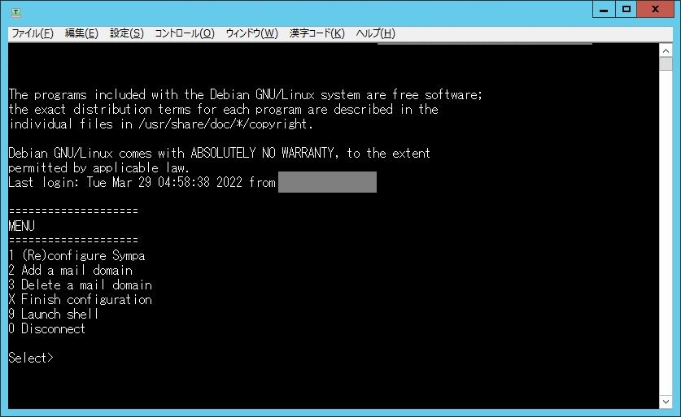

\[[**Japanese**](./)\]
\[**English**\]

Sympa AMI
=========

Prerequisites
========

## Hardware requirements

### Recommended specifications

  - Physical memory: 2 GB or more.
  - Free disk space: 512 MB or more.

    If a large number of lists are to be managed, more physical memory and disk space than the above are required.

    The database and list configuration information consumes very little space, but
    mail archives are expected to consume about three times the total amount of  stored messages.

## Network requirements

### Network security

The following traffic should be allowed in the security group settings: 

  - Inbound:

    HTTP/HTTPS (80/443)

    SMTP (25)

  - Outbound:

    SMTP(25)

## SMTP restrictions

### Remove restrictions on sending emails on AWS

  - In the [Request form](https://aws.amazon.com/jp/premiumsupport/knowledge-center/ec2-port-25-throttle/), specify the IP address to be unrestricted.

    Note that, at this time, also specify the value of the reverse lookup record (FQDN) for that IP address in "Elastic IPs information". If the application is accepted, this record is automatically set.

  - Without this request, only a small amount of emails can be sent out.

  - User with Admin rights can submit request.

## Required parameters

  * Email domain name.

    Prepare the email domain name to be used for the Sympa mailing list service.

  * Email address(es) of the listmaster(s).

    Prepare the email address(es) to manage the Sympa mailing list.
    The addresses of real humans are required.

  * Web site URL prefix.

    This is required if the Sympa mailing list is managed via a web GUI.
    The host part of the URL can be different from the email domain name above.

MX and A records must be registered on the DNS server in advance so that the host name of email domain name and web site URL above can be resolved.
If Sympa is operated with multiple email domain names, these parameters are required for each email domain name.
The same listmaster email address(es) can be set for all email domains.
The web site URL prefix is required if you want to provide a web interface for that email domain. In this case, the prefixes for different email domains must not overlap.

AMI information
=======

Release date: 2022-04-01

  * AMI Name:

    AMI de Sympa 2022-03-16_01 (Debian 11 AMD64)

  * AMI ID:

    ami-01b5f7f5d17362e0d

  * Region:

    us-east-2

The next update is scheduled for Oct. 2022.

Note:
Currently, this AMI is only available in specific region. If you wish to use it in a region not listed above, please copy the AMI to your own region.

AMI configuration procedure
===========

### 1. Launch instance from image

  1. On EC2 Dashboard, select 'Image' > 'AMI' in the left pane.
  2. Select 'Public Image' from the search box pull-down and enter AMI ID above.
  3. Select the image and under 'Action' select 'Launch'.
  4. Create an instance and set the security group according to your requirements.
     Create the SSH key pair as necessity.
  5. Once the created instance has been started, select 'Network & Security' > 'Elastic IP' in the left pane and associate the IP address with the instance.

### 2. Initial configuration

  1. Access to the instance via SSH. Note that the login user is 'admin'.

     ----

  2. Log in and a menu will appear.

     

     Select "(Re)configure Sympa": Enter '1' and press Enter.

     Thereafter, perform basic configuration of the Sympa and related software.

