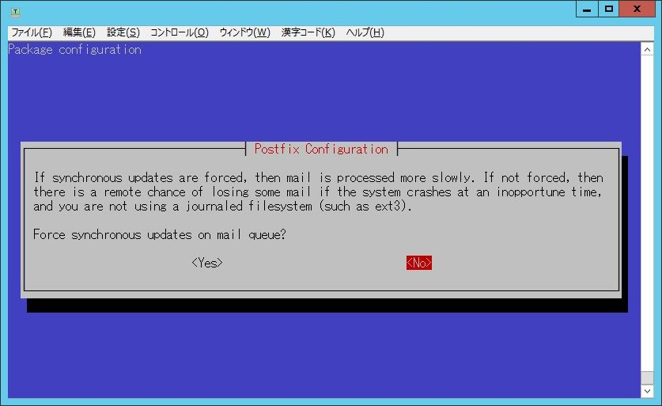

前提条件
========

## ハードウェア要件

### 推奨構成

  - 物理メモリ：2GB以上推奨
  - 空きディスク容量：512MB以上推奨

    データベースおよびリスト設定情報の領域はほとんど消費しませんが、
    投稿保管庫 (アーカイブ) は、保存メッセージ総量の3倍程度が見込まれます。

## ネットワーク要件

### ネットワークセキュリティ

セキュリティグループ設定

  - インバウンド

    HTTP/HTTPS(80/443)

    SMTP(25)

  - アウトバウンド

    SMTP(25)

## SMTP制限

### AWSでのメール送信制限解除

  - [申請フォーム](https://aws.amazon.com/jp/premiumsupport/knowledge-center/ec2-port-25-throttle/)で、制限解除するIPアドレスを指定する。

  - それと同時に、そのIPアドレスの逆引きレコードの値を指定する。申請が受理されると逆引きが設定されます。

  - 申請なしでも少量のメールは出せます。

  - Admin権限持ったユーザで実施します。

Elastic IPs information でホスト名を設定します。
ここで設定したホスト名を逆引きレコードに自動的に設定してくれるのでこの設定は必須です。

## 必要なパラメータ

  * メールドメイン名

    Symapaメーリングリストで利用するメールドメイン名をご準備ください。

  * リストシステム管理者のメールアドレス (複数可)

    Sympaメーリングリストの管理を行うメールアドレスをご準備ください。
    実在するアドレスが必要となります。

  * ウェブサイトURLプリフィクス

    Sympaメーリングリストの管理をWeb GUIで行う場合は必要となります。
    URLのホスト部分は上記メールドメイン名と異なっていても構いません。
    
    
上記のメールドメイン名およびウェブサイトが名前解決できるようMXレコードやAレコードをDNSサーバに事前に登録しておく必要があります。
複数のメールドメイン名でSympaを運用する場合、メールドメイン名ごとにこれらのパラメータが必要です。
リストシステム管理者のメールアドレスについては同じものを設定することもできます。
ウェブサイトURLプリフィクスについては、そのメールドメインでウェブインタフェースを提供する場合に必要です。その際、異なるメールドメイン同士でのウェブサイトURLプリフィクスは重複してはなりません。

AMI設定手順
===========
【】で記載しているものは設定例です。

### 1. イメージからのインスタンス起動

<<画像未採取>>

  1. 左ペインのイメージ＞AMIを選択します。
  2. 検索BOXのプルダウンから「パブリックイメージ」を選択し、検索するAMI名として「Sympa」を入力します。
  3. 【AMI de Sympa】を選択し、「アクション」で「起動」を選択します。
  4.  利用要件に合わせてインスタンスの作成およびセキュリティグループを設定してください。
      ここでSSH鍵ペアを作成します。
  5.  作成したインスタンスが起動したら「Elastic IP」をインスタンスと関連付けします。

### 2. 初期設定

  1. インスタンスにSSHでアクセスします。ログインユーザは「admin」です。

  2. ログインするとメニューが表示されます。

     

     「(Re)configure Sympa」を選択します。「1」を入力し、Enterキーを押します。

以後、Postfixの基本設定を行います。

  3. Postfix Configuration
 
     

     「OK」を選択、Enterキーを押します。

     

     通常は「Internet Site」、「Internet with smarthost」のいずれかを選択します。

     ----

  4. System mail name

     

     Postfixが使用するメールドメイン名の初期値を設定します。
     これは「必要なパラメータ」で決めたメールドメイン名と同じでも、
     異なっていてもかまいません。
     
     設定例【amidesympa.example.org】

     入力後「OK」を選択、Enterキーを押します。
     
     ----

  5. Root and postmaster mail recipient

     

     実在するメールアドレスを設定します。
     設定例【test@example.jp】

     入力後「OK」を選択、Enterキーを押します。
     

     ----

  6. Other destinations to accept mail for

     

     特に設定すべきものがなければ、変更しなくてもかまいません。
     「blank for none」と表示されますが、空白とした場合は、
     デフォルト設定となります。

     入力後「OK」を選択、Enterキーを押します。

     ----

  7. Force synchronous updates on mail queue?

     

     特に理由がないかぎり変更不要です。
     【No】

     選択後、Enterキーを押します。

     ----

### 3. Sympaの初期設定

続いてSympaの初期設定を行います。

  1. Sympa hostname

     

      Sympaのホスト名を入力します。
      これは「必要なパラメータ」で決めたメールドメイン名を設定します。
      設定例【amidesympa.example.org】

     「OK」を選択、Enterキーを押します。

     ----

  2. Listmaster email address(es) <a id="section-3-2"/>

     

     これは「必要なパラメータ」で決めたリストシステム管理者のメールアドレスを設定します。
     設定例【test@example.jp】

     「OK」を選択、Enterキーを押します。

     ----

  3. URL to access WWSympa <a id="section-3-11"/>

     
    
     これは「必要なパラメータ」で決めたウェブサイトURLプリフィクスを設定します。
     設定例【http://amidesympa.example.org/wws】

     「OK」を選択、Enterキーを押します。

     ----

  4. Which Web Server(s) are you running?

     
     
     利用するWeb Serverを選択します。Apache2を推奨します。
      設定例【Apache2】

     「OK」を選択、Enterキーを押します。

     ----

  5. Do you want the sympa SOAP server to be used?

     

     設定例【No】

     「OK」を選択、Enterキーを押します。

     ----

  6. Should the web archives and the bounce directory be removed?

     
     
     残っているデータを全て削除する場合は「Yes」を選択します。
     初回なので「No」を選択します。
     設定例【No】

     「OK」を選択、Enterキーを押します。

     ----

  7. Configure database for sympa with dbconfig-common?

     
     
     dbconfig-common を用いてDBを設定します。
     「Yes」を選択します。
     設定例【Yes】

     「OK」を選択、Enterキーを押します。

     ----

  8. Database type to be used by sympa

     

     使用するデータベースを選択します。「mysql」を推奨します。
     以後は「mysql」を選択した手順を記載します。
     【mysql】

     「OK」を選択、Enterキーを押します。

     ----

  9. MySQL application password for sympa

    
     
     任意のパスワードを設定してください
     【●●●●●】

     「OK」を選択、Enterキーを押します。

     ----

 10. Password confirmation

     
     
     前項で設定したパスワードを再入力します。
     【●●●●●】

     「OK」を選択、Enterキーを押します。

     ----

  ★. 初期設定が完了するとメニューに戻ります。

　[[ここにメーニューを貼る]]

--------------------------------------------------------------------------------------------------

### 4. Web管理画面からの操作

続いてSympaのWeb管理画面から操作を行います。

  1. Webブラウザから「手順[3-11](#section-3-11)」で設定したURLにアクセスします。

     

     【http://amidesympa.example.org/wws】
     
     ようこそ画面が表示されることを確認します。

     ----

  2. 右上のログインボタンをクリックし、ログイン画面に遷移します。

     
     
     画面下の【まだログインしたことがない】を選択します。

     ----

  3. あなたのメールアドレス

     ![図27]

     [3-2](#section-3-2). Listmaster email address(es) で入力したメーリングリスト管理者のメールアドレスを入力し、
     「初期パスワードの取り寄せ」ボタンをクリックします。

     ----

  4. メーリングリスト管理者宛てに初期パスワードが届きます。

     

     ※画像はサンプルです。
     
     URLをクリックしてパスワード設定画面に遷移します。

     ----

  5. メーリングリスト管理者のパスワードを設定します。

     

     ----
  
  以上で設定が完了します。
