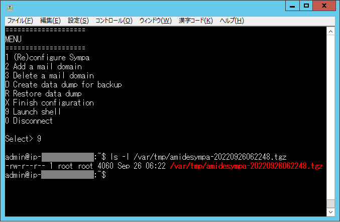

\[**Japanese**\]
\[[English](../en/replace.md)\]

\[[Sympa AMI](../) &gt; AMIリプレース手順\]

Sympa AMI
=========

AMIリプレース手順
-----------
本手順は下記前提で記載してます。

・新旧AMI間でリストのバックアップ/リストアに対応している。

・インスタンスのIPにはElasticIPを使用している。

・AMIリプレース時に既存インスタンスからIPの付け替えを行う。

・アーカイブ(書庫)のデータは移行しない。

---------
### 1. バックアップを取得

  1. 既存インスタンスにSSHでアクセスします。

  2. バックアップ取得

     「Create data dump for backup」を選択します。「D」を入力し、Enterキーを押します。

     

     以下の様に表示されますので、キー入力を行い、メニューを表示させます。
     
     

  3. バックアップファイル確認

     「Launche shell」を選択します。「9」を入力し、Enterキーを押します。
     
     バックアップファイルが作成されている事を確認します。
     
     ls -l /var/tmp/amidesympa-XXXXXXXXXXXXXX.tgz
     
     

---------

### 2. リプレース先のインスタンスを作成

  1. [AMI設定手順](../setup.md)に従い、初期設定を実施します。
  2. 旧インスタンスからElasticIPの付け替えを行います。

---------

### 3. バックアップファイル転送
  「1. バックアップを取得」で作成したバックアップファイルをリプレース先のインスタンスに転送します。
  
  本手順では、/tmpに転送してます。

---------

### 4. バックアップファイルからリストア

  1. リプレース先のインスタンスにSSHでアクセスします。
  2. バックアップファイルからリスト
     「Restore data dump」を選択します。「R」を入力し、Enterキーを押します。
        「Enter dump file name」と表示されたら転送したバックアップファイルをフルパスで入力し、Enterキーを押します。

     

     以下の様に表示されますので、キー入力を行い、メニューを表示させます。
     
     

---------
  以上でAMIのリプレースが完了します。
  
  リプレース後はconfigチェック、正常性確認、メール送信テスト等を実施される事をお勧め致します。
