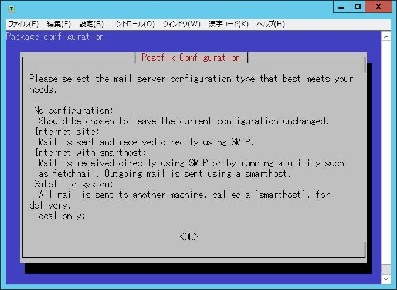
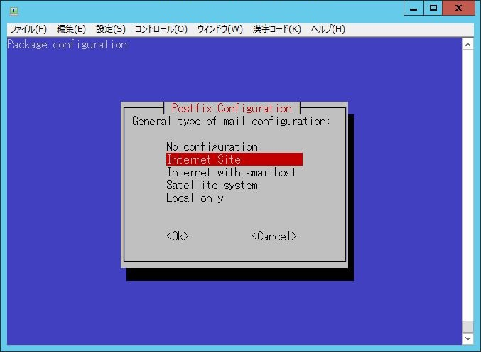
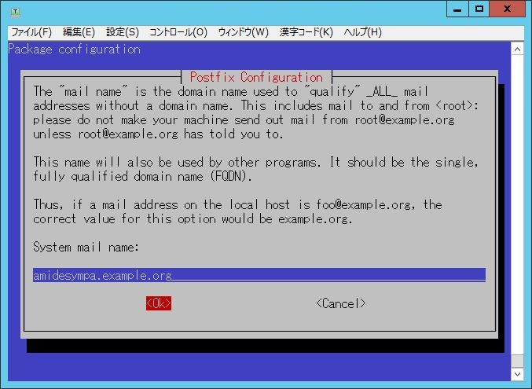
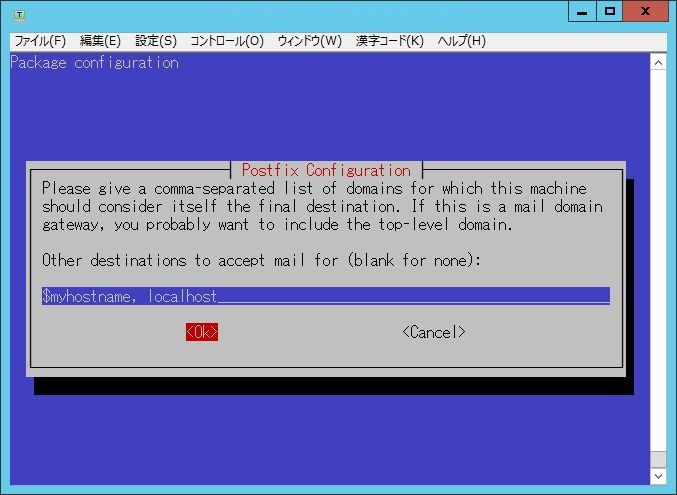
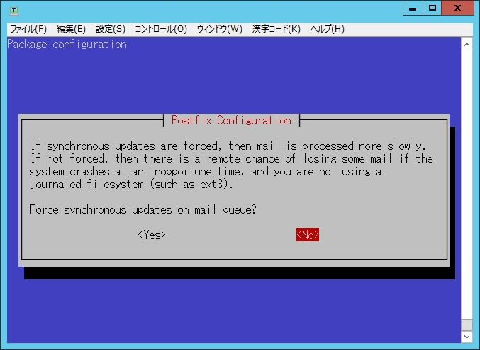
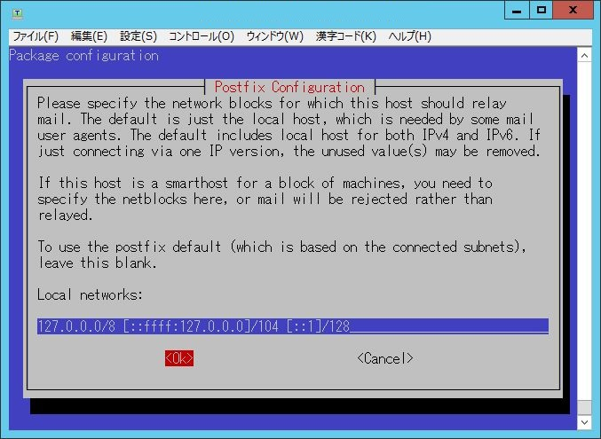
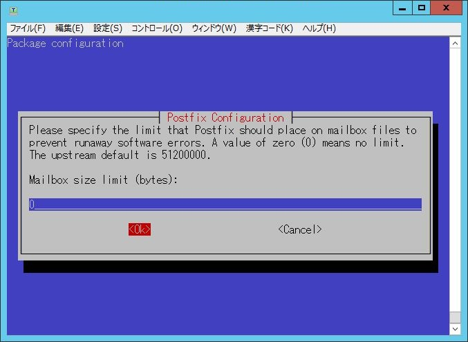
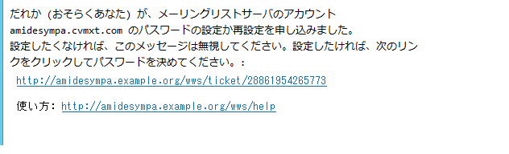

前提条件
========

## ハードウェア要件

### 推奨構成

    物理メモリ：2GB以上推奨
    空きディスク容量：512MB以上推奨
        データベースおよびリスト設定情報の領域はほとんど消費しませんが、
        投稿保管庫 (アーカイブ) は、保存メッセージ総量の3倍程度が見込まれます。

## ネットワーク要件

### ネットワークセキュリティ

・セキュリティグループ設定
 - インバウンド
   HTTP/HTTPS(80/443)
   SMTP(25)

 - アウトバウンド
   SMTP(25)

## SMTP制限

### AWSでのメール送信制限解除
https://aws.amazon.com/jp/premiumsupport/knowledge-center/ec2-port-25-throttle/

・この申請フォームで、制限解除するIPアドレスを指定する。

・それと同時に、そのIPアドレスの逆引きレコードの値を指定する。申請が受理されると逆引きが設定されます。

・申請なしでも少量のメールは出せます。

・Admin権限持ったユーザで実施します。

Elastic IPs information でホスト名を設定します。
ここで設定したホスト名を逆引きレコードに自動的に設定してくれるのでこの設定は必須です。

## 必要なパラメータ

  * メールドメイン名

    Symapaメーリングリストで利用するメールドメイン名をご準備ください。

  * リストシステム管理者のメールアドレス (複数可)

    Sympaメーリングリストの管理を行うメールアドレスをご準備ください。
    実在するアドレスが必要となります。

  * ウェブサイトURLプリフィクス

    Sympaメーリングリストの管理をWeb GUIで行う場合は必要となります。
    URLのホスト部分は上記メールドメイン名と異なっていても構いません。
    
    
上記のメールドメイン名およびウェブサイトが名前解決できるようMXレコードやAレコードをDNSサーバに事前に登録しておく必要があります。
複数のメールドメイン名でSympaを運用する場合、メールドメイン名ごとにこれらのパラメータが必要です。
リストシステム管理者のメールアドレスについては同じものを設定することもできます。
ウェブサイトURLプリフィクスについては、そのメールドメインでウェブインタフェースを提供する場合に必要です。その際、異なるメールドメイン同士でのウェブサイトURLプリフィクスは重複してはなりません。

AMI設定手順
===========
【】で記載しているものはサンプルです。

### 1. イメージからのインスタンス起動

<<画像未採取>>

  1. 左ペインのイメージ＞AMIを選択します。
  2. 検索BOXのプルダウンから「パブリックイメージ」を選択し、検索するAMI名として「Sympa」を入力します。
  3. 【AMI de Sympa】を選択し、「アクション」で「起動」を選択します。
  4.  利用要件に合わせてインスタンスの作成およびセキュリティグループを設定してください。
      ここでSSH鍵ペアを作成します。
  5.  作成したインスタンスが起動したら「Elastic IP」をインスタンスと関連付けします。
  
  
  

### 2. 初期設定

 2-1. インスタンスにSSHでアクセスします。ログインユーザは「admin」です。

 2-2. ログインするとメニューが表示されます。

     「(Re)configure Sympa」を選択します。「1」を入力し、Enterキーを押します。

以後、Postfixの基本設定を行います。

 2-3. Postfix Configuration
 

     「OK」を選択、Enterキーを押します。

     通常は「Internet Site」、「Internet with smarthost」のいずれかを選択します。

--------------------------------------------------------------------------------------------------

 2-4. System mail name

     Postfixが使用するメールドメイン名の初期値を設定します。
     これは「必要なパラメータ」で決めたメールドメイン名と同じでも、
     異なっていてもかまいません。
     
     設定例【amidesympa.example.org】

     入力後「OK」を選択、Enterキーを押します。
     
--------------------------------------------------------------------------------------------------

 2-5. Root and postmaster mail recipient

     実在するメールアドレスを設定します。
     設定例【test@example.jp】

     入力後「OK」を選択、Enterキーを押します。
     

--------------------------------------------------------------------------------------------------

 2-6. Other destinations to accept mail for

     特に設定すべきものがなければ、変更しなくてもかまいません。
     「blank for none」と表示されますが、空白とした場合は、
     デフォルト設定となります。

     入力後「OK」を選択、Enterキーを押します。

--------------------------------------------------------------------------------------------------

 2-7. Force synchronous updates on mail queue?

     特に理由がないかぎり変更不要です。
     【No】

     選択後、Enterキーを押します。

--------------------------------------------------------------------------------------------------

 2-8. Local networks

     メッセージの中継を受けるネットワークブロックを設定します。
     
     設定例【127.0.0.0/8 [::ffff:127.0.0.0]/104 [::1]/128】 ※デフォルト値

     入力後「OK」を選択、Enterキーを押します。

--------------------------------------------------------------------------------------------------

 2-9.  Mailbox size limit (bytes)

     特に理由がないかぎり変更不要です。
     【0】(無制限)

     入力後「OK」を選択、Enterキーを押します。

--------------------------------------------------------------------------------------------------

 2-10. Local address extension character

     「+」のままにしておかなければなりません。
     【+】

     「OK」を選択、Enterキーを押します。

--------------------------------------------------------------------------------------------------

 2-11. Internet protocols to use

     適切なものを選択します。
     設定例【all】

     「OK」を選択、Enterキーを押します。

--------------------------------------------------------------------------------------------------

  3. 続いてSympaの初期設定を行います。

 3-1. Sympa hostname

     「OK」を選択、Enterキーを押します。

      Sympaのホスト名を入力します。
      これは「必要なパラメータ」で決めたメールドメイン名を設定します。
      【amidesympa.example.org】

     「OK」を選択、Enterキーを押します。

--------------------------------------------------------------------------------------------------

 3-2. Listmaster email address(es)

     Sympaメーリングリスト管理者のメールアドレスを入力します。
     【test@example.jp】

     「OK」を選択、Enterキーを押します。

--------------------------------------------------------------------------------------------------

 3-3. Reinstall database for sympa?

     「OK」を選択、Enterキーを押します。

      初回は必ず「Yes」を選択します。
     【Yes】

     「OK」を選択、Enterキーを押します。

--------------------------------------------------------------------------------------------------

 3-4. Database type to be used by sympa

     「OK」を選択、Enterキーを押します。

     使用するデータベースを選択します。「mysql」を推奨します。
     【mysql】

     「OK」を選択、Enterキーを押します。

     以後、データベースの詳細設定と作成が行われます。

--------------------------------------------------------------------------------------------------
 3-5. Connection method for MySQL database of sympa

      Unix socket
      TCP/IP
      
     【Unix Socket】

     「OK」を選択、Enterキーを押します。

--------------------------------------------------------------------------------------------------

 3-6. MySQL database name for sympa

     【sympa】

     「OK」を選択、Enterキーを押します。

--------------------------------------------------------------------------------------------------

 3-7. MySQL username for sympa

     「OK」を選択、Enterキーを押します。

     
     【sympa@localhost】
     
     「OK」を選択、Enterキーを押します。

--------------------------------------------------------------------------------------------------

 3-8. MySQL application password for sympa

     
     任意のパスワードを設定してください
     【●●●●●】

     「OK」を選択、Enterキーを押します。

--------------------------------------------------------------------------------------------------

 3-9. Password confirmation

     
     前項で設定したパスワードを再入力します。
     【●●●●●】

     「OK」を選択、Enterキーを押します。

--------------------------------------------------------------------------------------------------

 3-10. Name of the database's administrative user

     
     rootのままでOKです。
     【root】

     「OK」を選択、Enterキーを押します。

--------------------------------------------------------------------------------------------------

 3-11. URL to access WWSympa

     
     【http://amidesympa.example.org/wws】

     「OK」を選択、Enterキーを押します。

--------------------------------------------------------------------------------------------------

 3-12. Which Web Server(s) are you running?

     
     私用するWeb Serverを選択します。Apache2を推奨します。
      【Apache2】

     「OK」を選択、Enterキーを押します。

--------------------------------------------------------------------------------------------------

 3-13. Do you want the sympa SOAP server to be used?

     【No】

     「OK」を選択、Enterキーを押します。

--------------------------------------------------------------------------------------------------

 3-14. Should sympanewaliases-wrapper be setuid root?

     「Yes」を選択します。
     ※このオプションは将来廃止予定ですが、現状では「Yes」を選択しないと正しく動作しません。
     【Yes】

     「OK」を選択、Enterキーを押します。

--------------------------------------------------------------------------------------------------

 3-15. Should the web archives and the bounce directory be removed?

     
     【No】

     「OK」を選択、Enterキーを押します。

--------------------------------------------------------------------------------------------------

  ★. 初期設定が完了するとメニューに戻ります。

--------------------------------------------------------------------------------------------------

 3-15. postfix手動設定(myhostname)
 

     「Launch shell」を選択します。「9」を入力し、Enterキーを押します。

     プロンプトが表示されたら下記コマンドにてrootにスイッチします。
     
     $ sudo su -
     
     下記コマンドにてmyhostnameの設定を変更します。
     
     # postconf myhostname=xxxxxxxxxx
     
     xxxxxxxxは「3-1. Sympa hostname」で設定したホスト名を入力します。

     postfixをreloadします。
     
     # systemctl reload postfix

--------------------------------------------------------------------------------------------------

  4. 続いてSympaのWeb管理画面から操作を行います。

 4-1. Webブラウザから「手順2-5」で設定したURLにアクセスします。

     【http://amidesympa.example.org/wws】
     
     ようこそ画面が表示されることを確認します。

--------------------------------------------------------------------------------------------------

 4-2. 右上のログインボタンをクリックし、ログイン画面に遷移します。

     
     画面下の【まだログインしたことがない】を選択します。

--------------------------------------------------------------------------------------------------

 4-3. あなたのメールアドレス

![図27]

     3-2. Listmaster email address(es) で入力したメーリングリスト管理者のメールアドレスを入力し、
     「初期パスワードの取り寄せ」ボタンをクリックします。

--------------------------------------------------------------------------------------------------

 4-4. メーリングリスト管理者宛てに初期パスワードが届きます。

     ※画像はサンプルです。
     
     URLをクリックしてパスワード設定画面に遷移します。

--------------------------------------------------------------------------------------------------

 4-5. メーリングリスト管理者のパスワードを設定します。

--------------------------------------------------------------------------------------------------
XXXXX下記は試せてません・・・XXXXX

### メールドメインの追加

メーリングリストサービスで使用するメールドメインの設定を行います。

複数のメールドメインを使う場合、本節の手順をメールドメイン毎に繰り返します。

  1. 「2」をタイプし、Enterキーを押します。

     

     次のものを入力します。

       * メールドメイン名。
       * リストシステム管理者のメールアドレス。
       * ウェブインタフェースのURLプリフィクス (あれば)。

     入力を確認し、「y」をタイプしてEnterを押します。

### その他の操作

  * 詳細な設定変更については、メニューで「9」を選択してシェルを起動します。

  * 接続を切断するには、メニューで「0」を選択します。
